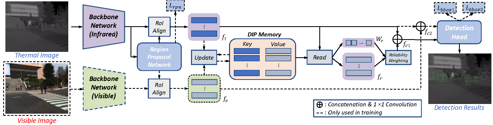

# Discrepancy Preserving (DIP) Memory

This is the code for our paper 'Retrieve the Visible Feature to Improve Thermal Pedestrian Detection
using Discrepancy Preserving Memory Network' that has been accepted by ICIP2023.

## About the code

Our code is build on mmdetection==2.16.0. We only present the modifications we have made to the mmdetection codebase. So you should put the python files under right locations and register them in '\_\_init\_\_.py'.